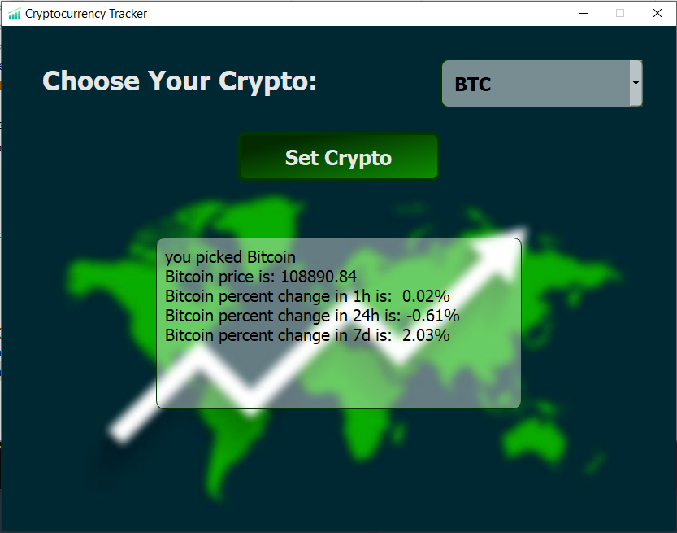

# 📊 Cryptocurrency Tracker

This is a desktop application built with Python and PyQt5 that allows users to track cryptocurrency information in an intuitive GUI. It also includes real-time charting, icons, and visuals to enhance user experience.

## 🚀 Features

- 📈 Real-time price tracking of popular cryptocurrencies
- 📊 Visualization of market trends
- 🔄 Auto-refreshing data
- 💻 Built with Python and data visualization libraries


## 📁 Project Structure

```
Cryptocurrency-Tracker/
├── Cryptocurrency_Tracker.py        # Main Python script to run the app
├── Cryptocurrency_Tracker.ui        # PyQt5 UI file
├── res.qrc                          # Qt resource file
├── res.py                           # Compiled Python resource file
├── icon.png                         # Icon for the app
├── icon2.png                        # Another icon used in the GUI
├── photo1.jpg                       # Used in GUI or about section
├── photo2.jpg                       # Additional image
├── screenshots/
│   └── screenshot.PNG               # App UI preview
└── README.md                        # Project documentation
```

## 📷 Screenshot

Here is a screenshot of the main page of the application:



## ▶️ Getting Started

1. Clone the repository:
   ```bash
   git clone https://github.com/Ghesmatireza8/Cryptocurrency-Tracker.git
   cd Cryptocurrency-Tracker
   ```

2. Install required packages:
   ```bash
   pip install -r requirements.txt
   ```

3. (Optional) If you modify the `.qrc` file, recompile it using:
   ```bash
   pyrcc5 res.qrc -o res.py
   ```

4. Run the app:
   ```bash
   python Cryptocurrency_Tracker.py
   ```

## 📦 Dependencies

- Python 3.x
- PyQt5
- Requests
- (Optional) pyqt5-tools for editing `.ui` files

## 👤 Author

**Reza Ghesmati**  
[GitHub Profile](https://github.com/Ghesmatireza8)

## 📝 License

This project is open source and available under the [MIT License](LICENSE).
